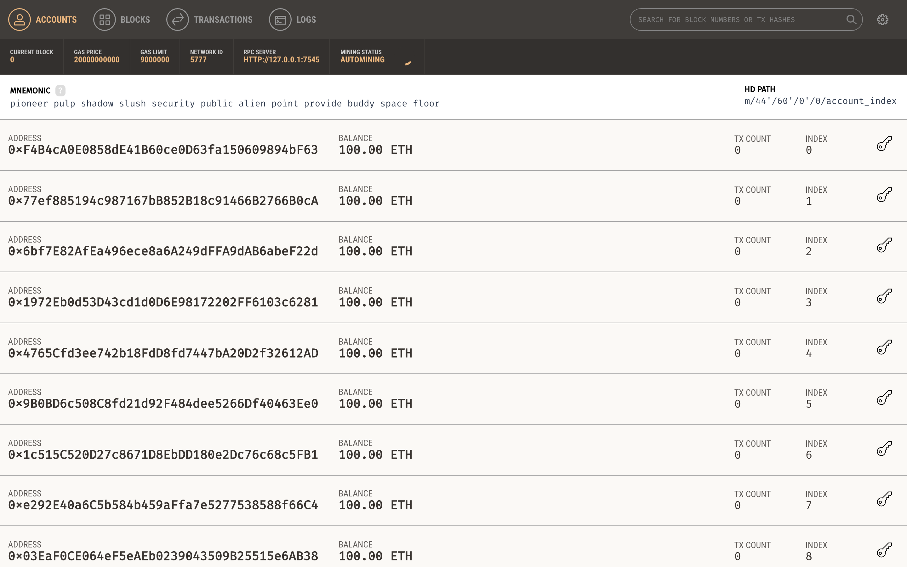

# Truffle 설치와 Test network 설치

Truffle은 이더리움 디앱 프레임워크입니다.
[트러플 홈페이지](https://truffleframework.com)

# Truffle 설치
프레임워크인 트러플을 설치합니다.
트러플을 사용하기 위해서는 nodejs 5.0이상이 설치되어 있어야 합니다.

```
npm install -g truffle
```

정상적으로 설치됐는지 확인하기 위해서 트러플 버전을 출력해봅니다
```
truffle --version
```

# test network 설치
dapp101에서 사용할 이더리움 네트워크를 설치합니다.
빠른 진행을 위해 테스트용으로 사용할 수 있는 Ganache를 설치합니다.

아래 링크에 접속해서 다운로드, 설치를 진행합니다.

[Ganache 설치 링크](https://truffleframework.com/ganache)

설치가 완료되면 Ganche를 실행합니다.




