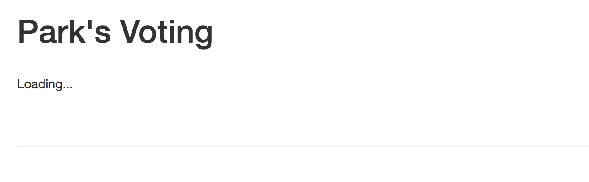
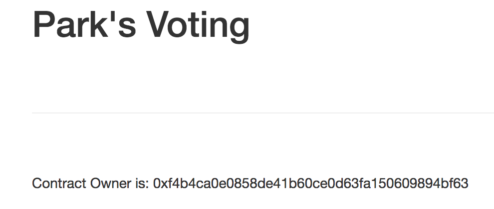

# web3.js를 이용해서 Front End 작성하기

어느정도 컨트랙트 만드는 방법은 익혔으니 브라우저에서 컨트랙에 접속해서 데이터를 가져오는 방법을 알아보도록 하겠습니다. 

서버로는 npm의 lite-server를 사용하며 lite-server의 설정은 bs-config.json에서 할 수 있습니다. 디폴트로 아래와 같이 설정되어 있습니다.

```
{
  "server": {
    "baseDir": ["./src", "./build/contracts"]
  }
}
```


## index.html 고치기

src/index.html을 열어 아래와 같이 고칩니다.
head 안의 title을 변경하고 body안을 변경합니다.

```
<!DOCTYPE html>
<html lang="en">
  <head>
    <meta charset="utf-8">
    <meta http-equiv="X-UA-Compatible" content="IE=edge">
    <meta name="viewport" content="width=device-width, initial-scale=1">
    <!-- The above 3 meta tags *must* come first in the head; any other head content must come *after* these tags -->
    <title>Park's Voting</title>

    <!-- Bootstrap -->
    <link href="css/bootstrap.min.css" rel="stylesheet">

    <!-- HTML5 shim and Respond.js for IE8 support of HTML5 elements and media queries -->
    <!-- WARNING: Respond.js doesn't work if you view the page via file:// -->
    <!--[if lt IE 9]>
      <script src="https://oss.maxcdn.com/html5shiv/3.7.3/html5shiv.min.js"></script>
      <script src="https://oss.maxcdn.com/respond/1.4.2/respond.min.js"></script>
    <![endif]-->
  </head>
  <body>
    <div class="container">

      <h1>Park's Voting</h1>

      <div class="loader">Loading...</div>

      <br>

      <hr>
      <br>

      <div class="contents"></div>

    </div>
    <!-- jQuery (necessary for Bootstrap's JavaScript plugins) -->
    <script src="https://ajax.googleapis.com/ajax/libs/jquery/1.12.4/jquery.min.js"></script>
    <!-- Include all compiled plugins (below), or include individual files as needed -->
    <script src="js/bootstrap.min.js"></script>
    <script src="js/web3.min.js"></script>
    <script src="js/truffle-contract.js"></script>
    <script src="js/app.js"></script>
  </body>
</html>
```

 스크립트를 로딩하는 부분에 보면 web3.min.js와 truffle-contract.js 를 불러오는 걸 확인할 수 있습니다. web3는 이더리움 노드에 접근할 수 있는 기능을 제공하는 라이브러리이며 truffle-contract는 트러플에서 제공하는 컨트랙트에 접속하는 기능을 제공하는 라이브러리 입니다.
app.js에 로딩된 라이브러리들을 사용해서 프로그래밍 합니다.

어떻게 보이는 지 확인봅니다. 아래 명령어를 실행시킵니다.

```
npm run dev
```

아래와 같이 브라우저에 표시되면 성공



## app.js 작성하기

### 네트워크 노드의 첫 번째 계좌 주소 표시하기
src/js/app.js를 열어 아래와 같이 수정합니다.

```
App = {
  web3Provider: null,
  contracts: {},

  init: function() {

    return App.initWeb3();
  },
  //접속할 이더리움의 노드를 설정하고 해당 노드의 첫 번째 어카운트 정보를 가져옵니다.
  initWeb3: function() {
    App.web3Provider = new Web3.providers.HttpProvider('http://localhost:7545');
 
    web3 = new Web3(App.web3Provider);
    App.account = web3.eth.accounts[0];
    return App.render();
  },

  render: function(){
    $('.loader').hide();
    $('.contents').show();
    $('.contents').html(App.account);
  }
};

$(function() {
  $(window).load(function() {
    App.init();
  });
});
```

initWeb3함수에서는 상호작용할(컨트랙트의 정보를 저장하거나 변경할) 이더리움 노드를 설정합니다. Web3.providers.HttpProvider()를 사용하며 파라미터로 테스트 네트워크를 지정합니다. 설정 후에 web3 객체를 생성합니다.

web3 객체를 이용해서 노드의 첫 번째 주소를 가져와 App.account에 저장하고 render함수를 호출해서 첫 번째 계좌 주소를 렌더링을 수행합니다.

### 컨트랙트 정보 표시하기

컨트랙트 정보에 접속하기 위해서는 트러플 라이브러리를 사용합니다.
app.js를 아래와 같이 변경합니다.

```
App = {
  web3Provider: null,
  contracts: {},

  init: function() {

    return App.initWeb3();
  },
  //접속할 이더리움의 노드를 설정하고 해당 노드의 첫 번째 어카운트 정보를 가져옵니다.
  initWeb3: function() {
    App.web3Provider = new Web3.providers.HttpProvider('http://localhost:7545');
 
    web3 = new Web3(App.web3Provider);
    App.account = web3.eth.accounts[0];
    return App.initContract();
  },

  initContract: function(){
    $.getJSON('Voting.json', function(voting){
      App.contracts.Voting = TruffleContract(voting);

      App.contracts.Voting.setProvider(App.web3Provider);
 
      return App.render();
    });
  },

  render: function(){
    var loader = $('.loader');
    var contents = $('.contents');
    var votingInstance;

    loader.show();
    contents.hide();

    App.contracts.Voting.deployed().then(function(instance){
      votingInstance = instance;
      votingInstance.getOwner.call().then(function(owner){
        contents.html("Contract Owner is: " + owner);
      });
    }).then(function(){
      loader.hide();
      contents.show();
    });
  }
};

$(function() {
  $(window).load(function() {
    App.init();
  });
});
```

initWeb3함수에서 노드를 설정하고 initContract는 사용할 컨트랙트를 설정합니다. render함수에서는 컨트랙트를 발행한 주소를 표시합니다.


```
initContract: function(){
    $.getJSON('Voting.json', function(voting){
      App.contracts.Voting = TruffleContract(voting);

      App.contracts.Voting.setProvider(App.web3Provider);
 
      return App.render();
    });
  },
```

initContract에서는 컨트랙트의 정보가 담긴 json파일을 불러온 후, TruffleContract를 사용해 컨트랙트 객체를 생성하고 저장합니다.

```
render: function(){
    var loader = $('.loader');
    var contents = $('.contents');
    var votingInstance;

    loader.show();
    contents.hide();

    App.contracts.Voting.deployed().then(function(instance){
      votingInstance = instance;
      votingInstance.getOwner.call().then(function(owner){
        contents.html("Contract Owner is: " + owner);
      });
    }).then(function(){
      loader.hide();
      contents.show();
    });
```

render함수에서는 설정된 컨트랙트 변수 App.contracts.Voting을 이용해 트러플 콘솔에서 사용한 방법으로 컨트랙트를 배포한 주소를 가져옵니다. 

lite-server를 실행 후에 배포한 주소가 나오면 성공

```
npm run dev
```



