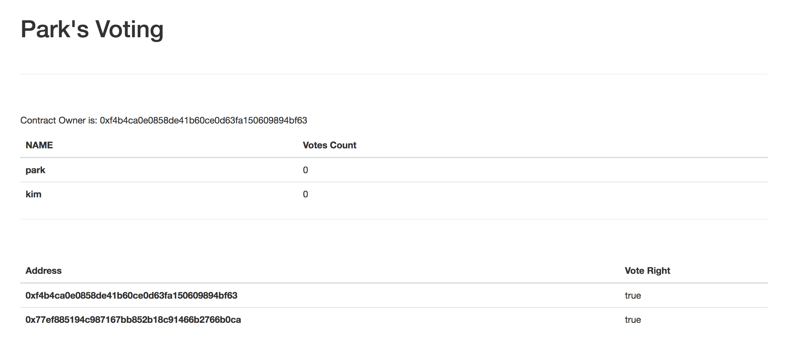

# 유권자 등록하기
이 번장에서는 투표를 할 수 있는 유원자를 등록하는 기능을 추가합니다.

## Voting.sol 수정하기

Voter 구조체를 address와 투표권한을 갖는 요소로 정의합니다.
mapping 타입이라는 새로운 형을 선언하였습니다. mapping은 해쉬테이블 또는 딕셔너리 타입과 비슷하며 key, value 를 사용해서 자료를 저장할 수 있습니다.

mapping (uint => Voter) 로 선언을 하면 key의 자료형은 uint, value의 자료형은 구조체 Voter로 지정한 것입니다. 예를 들어 voterList[0] = Voter(0x1241412, true); 이렇게 사용할 수 있습니다.

mapping은 몇 개가 저장되어 있는지 알 수 없기 때문에 길이를 저장할 변수 voterCount를 선언합니다.
***(후보자를 등록할 때는 array를 사용했고 유권자를 등록할 때는 mapping 사용했습니다. 어떤게 더 좋을까요?)***

```
struct Voter{
  address voterAddress;
  bool right;
}

mapping (uint => Voter) private voterList;
uint8 private voterCount;
```

후보자를 등록할 addVoter를 추가하고, 후보자의 정보와 후보자가 총 몇명 등록됐는지를 반환하는 함수를 정의합니다. 

```
function addVoter (address _voter) public {
  voterList[voterCount] = Voter(_voter, true);
  voterCount++;
}

function getVoter(uint8 _id) public view returns(address, bool){
  return (voterList[_id].voterAddress, voterList[_id].right);
}

function getVoterCount() public view returns (uint8){
  return voterCount;
}
```
 
Voting.sol을 수정했으면 컴파일, 배포를 다시 합니다.
```
truffle compile
truffle migrate --reset
```

트러플 콘솔로 접속해서 유권자를 등록해봅니다.
```
truffle console
Voting.deployed().then(function(ins){i=ins;});
i.addVoter(web3.eth.accounts[0]);
i.getVoter(0)
```

테스트 네트워크에 등록된 첫 번째 계좌 주소가 반환되면 성공입니다.

## index.html 수정하기

유권자 정보를 표시할 테이블을 작성합니다.

```
<div class="contents">
    <div>
        <p class="owner"></p>
        <table class="table">
        <thead>
          <th>NAME</th>
          <th>Votes Count</th>
        </thead>
        <tbody class="candidateList"></tbody>
        </table>
        <hr>
        <br>
        <table class="table">

        <thead>

          <th>Address</th>

          <th>Vote Right</th>

        </thead>

        <tbody class="voterList"></tbody>

        </table>
    </div>
</div>

```

## app.js render 함수 수정하기

후보자를 리스팅한 후, 유권자를 리스팅을 합니다. 
방법은 후보자를 리스팅 했던 것과 동일합니다. 
***(리스팅하는 게 중복이네요. 리팩토링을 하려면 어떻게 해야할까요?)***

```
render: function(){
    var loader = $('.loader');
    var contents = $('.contents');
    var ownerTag = $('.owner');

    var votingInstance;

    loader.show();
    contents.hide();

    App.contracts.Voting.deployed().then(function(instance){
      votingInstance = instance;
      votingInstance.getOwner.call().then(function(owner){
        ownerTag.html("Contract Owner is: " + owner);
      });

      return votingInstance.getCandidateListLength.call();
    }).then(function(count){
      var candidateCount = count.toNumber();
      var candidateList = $('.candidateList');

      for(var i=0; i < candidateCount; i++){
        votingInstance.getCandidate(i).then(function(candidate){
          var name = candidate[0];
          var voteCount = candidate[1];
          var candidateTemp = "<tr><th>" + name + "</th><td>" + voteCount + "</td></tr>";

          candidateList.append(candidateTemp);
        });
      }
      return votingInstance.getVoterCount();
    }).then(function(vCount){
      var voterCount = vCount.toNumber();
      var voterList = $('.voterList');

      for(var i=0; i < voterCount; i++){
        votingInstance.getVoter(i).then(function(voter){
          var address = voter[0];
          var right = voter[1];
          var voterTemp = "<tr><th>" + address + "</th><td>" + right + "</td></tr>";

          voterList.append(voterTemp);
        });
      }

    }).then(function(){
      loader.hide();
      contents.show();
    });
  }
```

lite-server를 실행했을 때 아래와 같이 나옵니다.

