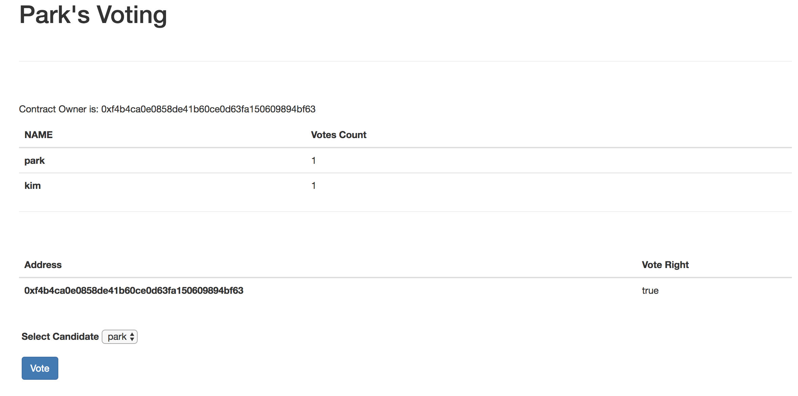
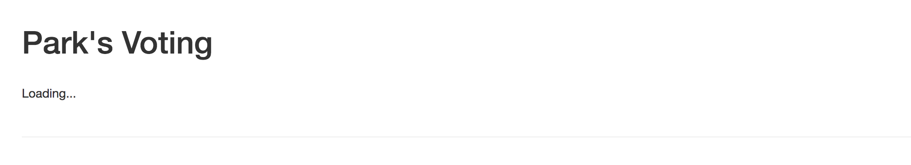

# Voting 구현하기

## Voting.sol 수정 - vote함수 구현

```
function vote(uint8 _id) public {
  candidateList[_id].voteCount++;
}
```

트러플 콘솔로 이동해서 직접 보팅 후에 결과를 확인해봅니다.
```
truffle console
Voting.deployed().then(function(ins){i=ins;});
i.vote(0); 
```

lite-server에서도 확인해 볼 수 있습니다.
 
## vote 함수 개선하기 - 유효한 후보자에게만 투표하게 하기

 위 함수는 후보자로 등록되어 있지 않는 사람에게도 투표할 수 있습니다. 
 이걸 현재 candidatesList에 있는 후보자에게만 할 수 있게 수정하겠습니다.

```
function vote(uint8 _id) public {
  require( _id >= 0 && _id < candidateList.length);
  candidateList[_id].voteCount++;
}
```

require는 안의 조건문을 만족할 때 이 후에 오는 명령문을 실행시킵니다.
투표를 할 때 파라미터 id는 0 이상이고 등록된 후보자의 수보다 작을 때 투표 수를 증가시킵니다.
(후보자는 0부터 시작합니다.)

트러플 콘솔로 이동해서 동작을 확인해봅니다.
아래 명령어는 정상동작 합니다.
```
truffle consle
Voting.deployed().then(function(ins){i=ins;});
i.addCandidate('park');
i.addCandidate('kim');
i.vote(0);
```

음수를 입력하거나 등록된 후보자의 수 이상을 입력하면 **revert**에러를 출력합니다.
```
i.vote(-1);
Error: VM Exception while processing transaction: revert
    at XMLHttpRequest._onHttpResponseEnd (/usr/local/lib/node_modules/truffle/build/webpack:/~/xhr2/lib/xhr2.js:509:1)
    at XMLHttpRequest._setReadyState (/usr/local/lib/node_modules/truffle/build/webpack:/~/xhr2/lib/xhr2.js:354:1)
    at XMLHttpRequestEventTarget.dispatchEvent (/usr/local/lib/node_modules/truffle/build/webpack:/~/xhr2/lib/xhr2.js:64:1)
    at XMLHttpRequest.request.onreadystatechange (/usr/local/lib/node_modules/truffle/build/webpack:/~/web3/lib/web3/httpprovider.js:128:1)
    at /usr/local/lib/node_modules/truffle/build/webpack:/packages/truffle-provider/wrapper.js:134:1
    at /usr/local/lib/node_modules/truffle/build/webpack:/~/web3/lib/web3/requestmanager.js:86:1
    at Object.InvalidResponse (/usr/local/lib/node_modules/truffle/build/webpack:/~/web3/lib/web3/errors.js:38:1)
```

require 문구를 사용하는 이유는 조건을 만족할 때만 다음 명령어를 수행하게 하려는 이유도 있지만 revert는 노드의 상태를 트랜잭션 수행 하기 전 단계로 이동시킵니다.

## voting Front 폼 작성하기
폼을 index.html에 추가합니다.
Vote 버튼을 클릭하면, App.vote()함수를 호출합니다. 
그리고 return false;구문에 의해서 더 이상 진행을 하지 않고 멈춰있습니다.
이 후 이벤트를 추가해서 이더리움 노드가 vote 트랜잭션을 수행하면 화면을 변경하는 구문을 추가할 것 입니다.

```
<div class="contents">
    <div>
      <p class="owner"></p>
      <table class="table">
        <thead>
          <th>NAME</th>
          <th>Votes Count</th>
        </thead>
        <tbody class="candidateList"></tbody>
      </table>
      <hr>
      <br>
      <table class="table">

        <thead>

          <th>Address</th>

          <th>Vote Right</th>

        </thead>

        <tbody class="voterList"></tbody>

      </table>
    </div>

    <form onsubmit="App.vote(); return false;">

      <div class="form-group">

        <label for="candidateSelect">Select Candidate</label>

        <select class="from-control" id="candidateSelect"></select>

      </div>

      <button type="submit" class="btn btn-primary">Vote</button>
    </form>

</div>

```

## app.js에 vote함수를 추가합니다.

### render 함수를 수정합니다.

중복으로 표시되는 것을 막기 위한 코드 candidateList.empty();candidateSelect.empty(); voterList.empty(); 를 추가하였습니다.
투표할 때 후보자를 선택할 수 있게 render함수를 수정합니다.

```
render: function(){
    var loader = $('.loader');
    var contents = $('.contents');
    var ownerTag = $('.owner');

    var votingInstance;

    loader.show();
    contents.hide();

    App.contracts.Voting.deployed().then(function(instance){
      votingInstance = instance;
      votingInstance.getOwner.call().then(function(owner){
        ownerTag.html("Contract Owner is: " + owner);
      });

      return votingInstance.getCandidateListLength.call();
    }).then(function(count){
      var candidateCount = count.toNumber();
      var candidateList = $('.candidateList');
      var candidateSelect = $('#candidateSelect');

      candidateList.empty();
      candidateSelect.empty();


      for(let i=0; i < candidateCount; i++){

        votingInstance.getCandidate(i).then(function(candidate){
          var name = candidate[0];
          var voteCount = candidate[1];
          var candidateTemp = "<tr><th>" + name + "</th><td>" + voteCount + "</td></tr>";

          var candidateOpt = "<option value='" + i +"'>" + name + "</option>";
          candidateList.append(candidateTemp);
          candidateSelect.append(candidateOpt);
        });
      }


      return votingInstance.getVoterCount();
    }).then(function(vCount){
      var voterCount = vCount.toNumber();
      var voterList = $('.voterList');
      voterList.empty();

      for(var i=0; i < voterCount; i++){
        votingInstance.getVoter(i).then(function(voter){
          var address = voter[0];
          var right = voter[1];
          var voterTemp = "<tr><th>" + address + "</th><td>" + right + "</td></tr>";

          voterList.append(voterTemp);
        });
      }

    }).then(function(){
      loader.hide();
      contents.show();
    });
  }
```

후보자를 표시하는 부분에 해당 후보자를 투툐 셀렉트 요소를 option으로 추가합니다.
for문안에 var i -> let i으로 변경하였습니다.

```
var candidateCount = count.toNumber();
var candidateList = $('.candidateList');
var candidateSelect = $('#candidateSelect');

candidateList.empty();
candidateSelect.empty();

for(let i=0; i < candidateCount; i++){

    votingInstance.getCandidate(i).then(function(candidate){
      var name = candidate[0];
      var voteCount = candidate[1];
      var candidateTemp = "<tr><th>" + name + "</th><td>" + voteCount + "</td></tr>";

      var candidateOpt = "<option value='" + i +"'>" + name + "</option>";
      candidateList.append(candidateTemp);
      candidateSelect.append(candidateOpt);
    });
}
return votingInstance.getVoterCount();
```


### vote 함수를 추가합니다.

```
vote: function(){
    var votingInstance;
    var candidateId = $('#candidateSelect').val();
    App.contracts.Voting.deployed().then(function(instance){
      votingInstance = instance;
      return votingInstance.vote(candidateId, {from: App.account});
    }).then(function(receipt){
      $('.loader').show();
      $('.contents').hide();
      $('from').hide();
    }).catch(function(err){
      alert(err);
    });
  }
```

votingInstance.vote(candidateId, {from: App.account});
{from: App.account} 구문은 트랜잭션의 gas를 소비를 할 계좌를 지정하는 부분입니다.
투표가 진행되면 지정된 계좌의 이더가 소비됩니다.
(현재는 네트워크의 첫 번째 계좌로 지정되어 있습니다.)

vote함수가 정상적으로 수행되면 화면에 loading 문구가 보입니다.



vote 버튼을 누른 후 모습



정상적으로 투표가 완려됐는지 확인하려면 브라우저에 새로고침을 눌러서 확인할 수 있습니다.
