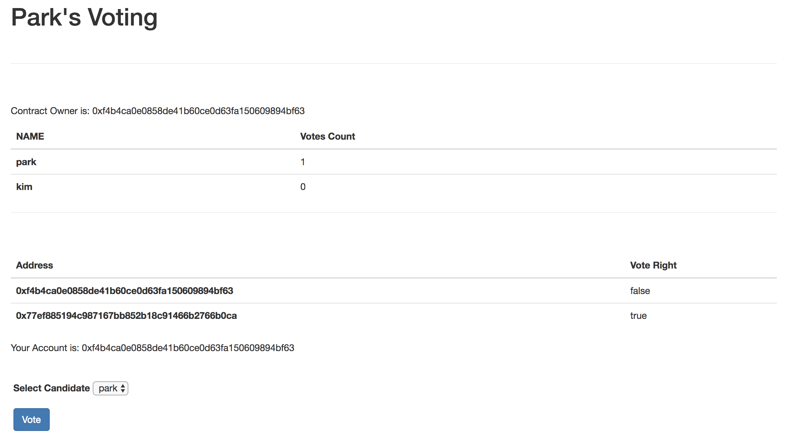

# 등록된 유권자만 투표할 수 있게 하기

투표를 할 수 있는 조건을 설정해보겠습니다. 이미 등록되어 있는 유권자만 투표가 가능하게 변경합니다.
require문을 사용해서 투표권한이 있을 때만 진행하도록 변경합니다.

## Voting.sol 수정하기

validateVoter 함수를 정의합니다. 해당 함수는 유권자의 투표권한을 반환합니다.
반환 값이 true이면, 후보자에 대한 투표가 진행되며 한 번 투표한 유권자의 권한을 false로 변경합니다.
***(중복된 코드가 보이네요. 리팩토링 또는 유권자의 자료구조를 변경할 필요가 있어보이네요)***

```
function vote(uint8 _id) public {
    require( _id >= 0 && _id < candidateList.length);
    require(validateVoter(msg.sender));
    candidateList[_id].voteCount++;
    changeright(msg.sender);
}

function validateVoter(address _sender) private view returns (bool){
    for(uint8 i = 0; i < voterCount; i++){
      if(voterList[i].voterAddress == _sender){
        return voterList[i].right;
      }
    }
    return false;
}

function changeright(address _sender) private {
    for(uint8 i = 0; i < voterCount; i++){
      if(voterList[i].voterAddress == _sender){
        voterList[i].right = false;
      }
    }
}
```

lite-server를 실행시키고 한 번 투표한 유권자를 false로 변경되는 것을 확인해보세요.
투표 후 새로고침을 해서 결과를 확인해보세요.
 
## 현재 사용중인 주소를 표시합니다.

index.html을 수정합니다.
```
<div class="yourAccount"></div>

<form onsubmit="App.vote(); return false;">
```

app.js를 수정합니다. render함수를 수정합니다.

```
render: function(){
    var loader = $('.loader');
    var contents = $('.contents');
    var ownerTag = $('.owner');

    var votingInstance;

    loader.show();
    contents.hide();

    App.contracts.Voting.deployed().then(function(instance){
      votingInstance = instance;
      votingInstance.getOwner.call().then(function(owner){
        ownerTag.html("Contract Owner is: " + owner);
      });

      $('.yourAccount').html("Your Account is: " + App.account);

      return votingInstance.getCandidateListLength.call();
    }
```

해당 프로젝트의 투표를 테스트 할 때는 initWeb3함수 안의 App.account를 설정하는 부분을 변경하면 됩니다.



권한이 false으로 변경된 후 투표를 하면 에러 창이 나타납니다.
