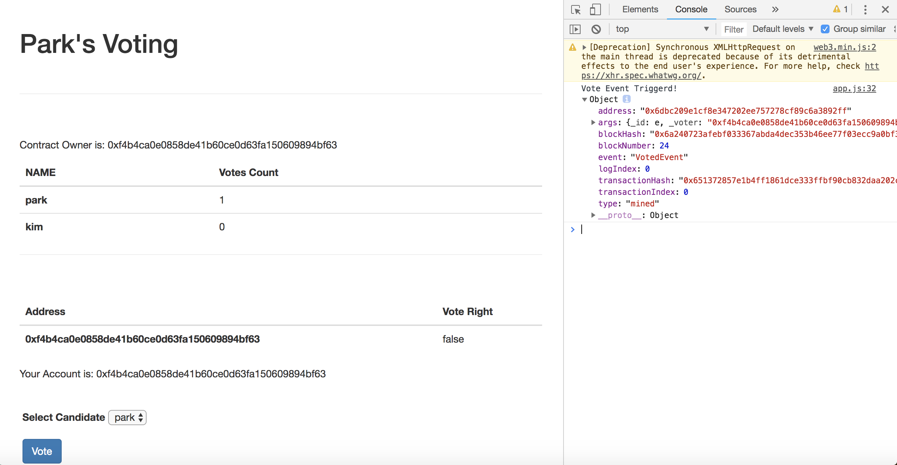

# voting한 결과가 반영되면 Front 반영시키기
현재는 투표 결과가 반영된 것을 보려면 브라우저 화면을 새로고침을 통해서만 확인할 수 있었습니다.
이 번에는 투표 결과가 블록체인에 반영이 되면 결과가 반영된 화면이 보이게 추가해보겠습니다.

## event 설정하기
이벤트 기능을 통해서 해당 기능을 구현합니다.
Voting.sol에 아래와 같이 event 를 추가합니다.
solidity에서 이벤트는 로그 기능을 역할을 한다고 생각하시면 됩니다.
등록된 이벤트가 발생하면 해당 데이터는 로그로 남게 됩니다.

```
event VotedEvent(uint8 _id, address _voter);

function vote(uint8 _id) public {
    require( _id >= 0 && _id < candidateList.length);
    require(validateVoter(msg.sender));
    candidateList[_id].voteCount++;
    changeright(msg.sender);
    emit VotedEvent(_id, msg.sender);
}

```
emit은 이벤트를 실행시키는 예약어입니다.
vote함수 안에 이벤트를 발생시키게 설정을 하면 vote 트랜잭션이 생기면 해당 이벤트 내용이 로그로 기록됩니다.

## app.js에 watchEvent함수를 추가합니다.

해당 이벤트가 발생하면 프런트에서 처리하는 watchEvent 함수를 추가합니다.
watch함수를 사용해서 이벤트 발생 후 실행 함 로직을 추가합니다.
VotedEvent가 발생하면 에러가 없을 시 render함수를 호출합니다.

```
  watchEvent: function(){
    App.contracts.Voting.deployed().then(function(instance){
      instance.VotedEvent().watch(function(err, event){
        console.log('Voted Event Triggered,', event);
        if(err){
          alert(err):
        }
        App.render();
      });
    })
  },
```
 

## initContract함수 안에 watchEvent함수를 호출합니다.

watchEvent를 등록하기 위해 initContract함수안에 watchEvent를 호출합니다.

```
initContract: function(){
    $.getJSON('Voting.json', function(voting){
      App.contracts.Voting = TruffleContract(voting);

      App.contracts.Voting.setProvider(App.web3Provider);
 
      App.watchEvent();
      return App.render();
    });
  },
```

투표 후 변경된 화면 모습은 아래와 같습니다.
투표가 반영된 화면을 보기 위해 새로고침 필요 없이 블록에 등록이 되면 이벤트를 통해서 화면이 변경됩니다.




